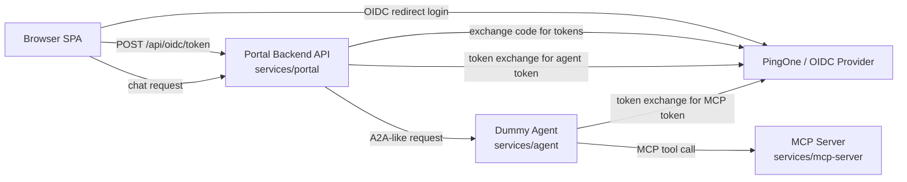
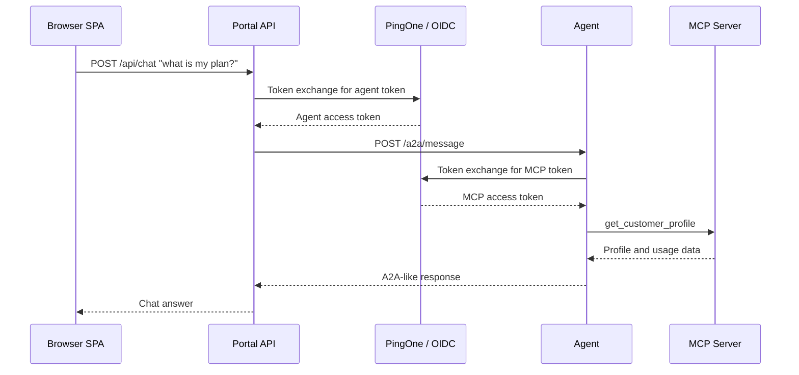
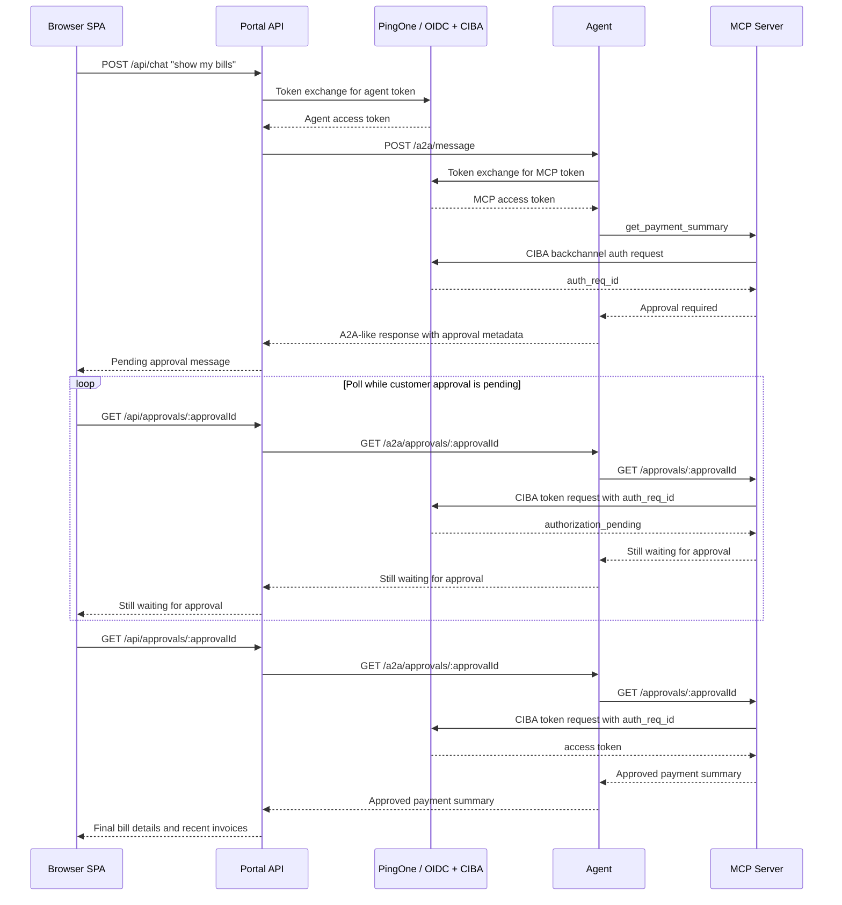

# Telco Customer AI Chatbot Demo

This is a mock telco customer-support chatbot project. Its goal is not to demonstrate a real LLM, but to demonstrate the identity and authorization patterns around an AI-style customer assistant:

- OIDC login for a browser-based customer portal.
- JWT validation at each service boundary.
- OAuth token exchange from the portal backend to the agent, and from the agent to MCP.
- MCP tool-level authorization with different scopes for profile and payment data.
- Human-in-the-loop payment access using CIBA.

The chatbot itself is deterministic. The agent exposes an A2A-like endpoint and internally uses an OpenAI-style mock chat-completion layer that returns tool calls, so the mock can later be replaced by a real LLM without changing the external agent contract.

## Components

- `services/portal`: plain HTML/JS SPA plus Node.js REST API. The SPA renders the public landing page, OIDC login, authenticated home page, and chatbot drawer. The backend validates frontend tokens, exposes `/api/me`, `/api/chat`, `/api/approvals/:approvalId`, and performs token exchange before calling the agent.
- `services/agent`: Node.js dummy customer-support agent. It validates inbound tokens, accepts an A2A-derived `message/send` JSON-RPC payload, invokes the mock OpenAI-style LLM layer, executes MCP tool calls, and returns the final agent response.
- `services/mcp-server`: Node.js MCP Streamable HTTP server using `@modelcontextprotocol/sdk`. It exposes mock customer profile and payment tools, validates inbound access tokens, enforces tool scopes, and starts/polls CIBA for payment data.
- `packages/shared`: shared auth, config, logging, HTTP, protocol, and scope helpers.

## Architecture



## Non-CIBA Flow

Profile and usage questions call the MCP profile tool only. No human approval is needed.



## CIBA Flow

Payment and bill questions call the MCP payment tool. The MCP tool is CIBA-protected, so the first response is an approval-pending status, not payment data. Polling then checks the approval status without making another LLM call; after approval, the browser receives the final bill details and recent invoices.



## Example Prompts

The documented prompts are examples. The mock agent uses deterministic keyword heuristics, not a real language model, to decide which MCP tool to call.

| Prompt | Tools | CIBA? | Behavior |
| --- | --- | --- | --- |
| `what is my current plan?` | `get_customer_profile` | No | Returns plan, account status, loyalty tier, cycle end, and usage. |
| `how much data have I used?` | `get_customer_profile` | No | Returns mobile and home data usage from the profile tool. |
| `what are my devices?` | `get_customer_profile` | No | Returns registered router/SIM devices and status. |
| `show my bills` | `get_payment_summary` | Yes | Starts CIBA, returns pending approval, then polling returns recent bills after approval. |
| `what is my latest bill?` | `get_payment_summary` | Yes | Same CIBA-protected payment path. |

Current heuristic keywords:

| Keyword family | Example keywords | Tool | CIBA? |
| --- | --- | --- | --- |
| Plan/service/profile | `plan`, `profile`, `service`, `fiber`, `mobile`, `subscription`, `package`, `tariff`, `contract` | `get_customer_profile` | No |
| Usage | `usage`, `data`, `speed` | `get_customer_profile` | No |
| Devices | `device`, `devices`, `router`, `sim` | `get_customer_profile` | No |
| Billing/payments | `bill`, `billing`, `payment`, `invoice`, `due`, `balance`, `autopay`, `charge`, `amount`, `statement` | `get_payment_summary` | Yes |

## MCP Tools And Scopes

| MCP tool | Purpose | Required inbound MCP scope |
| --- | --- | --- |
| `get_customer_profile` | Customer plan, services, devices, status, usage | `customer-support-agent:customer-mcp:profile:read` |
| `get_payment_summary` | Balance, due date, autopay, last payment, recent invoices | `customer-support-agent:customer-mcp:payments:read` |

The CIBA scope is separate from MCP authorization. MCP authorization is based on the inbound agent-to-MCP access token. `CIBA_SCOPE` only needs to match the PingOne CIBA app/policy requirements, often `openid`.

## PingOne Configuration

The demo is generic OIDC/OAuth, but the `.env.example` names the values you need from PingOne.

### Authorization Model

In PingOne, applications and API resources are separate concepts:

- **Applications** are OAuth/OIDC clients. They initiate login, receive tokens, or use client credentials to perform backend exchanges.
- **API resources** represent protected APIs. They define the token audience and the scopes that authorize access to that API.
- **Application-resource grants** decide which application can request which scopes for which API resource.

This demo follows that model at every boundary. When one component needs to call another protected component, the caller application must be granted access to the callee API resource scopes.

| Call path | Caller application | Target API resource | Scope requested |
| --- | --- | --- | --- |
| Browser SPA -> Portal API | `Customer Support Agent - Customer Portal` | Portal API resource | `customer-support-agent:portal-api:chat` |
| Portal API -> Agent API | `Customer Support Agent - Customer Portal API` | Agent API resource | `customer-support-agent:agent:invoke` |
| Agent -> MCP Server | Agent backend application/client | MCP API resource | `customer-support-agent:customer-mcp:profile:read` and `customer-support-agent:customer-mcp:payments:read` |
| MCP Server -> PingOne CIBA | CIBA-enabled MCP application/client | PingOne CIBA policy | `CIBA_SCOPE`, usually `openid` |

If PingOne does not grant the caller application access to the target API resource/scope, token exchange succeeds only up to the scopes the caller is allowed to request, or fails with an OAuth error depending on policy.

### PingOne Objects Used By This Demo

The local services use these PingOne applications plus API resources:

| PingOne object | Example app ID | Used by | Environment variables |
| --- | --- | --- | --- |
| `Customer Support Agent - Customer Portal` | `b0065845-ad96-441f-83cc-65fa59fd9713` | Browser OIDC login and authorization-code flow | `OIDC_CLIENT_ID`, optional `OIDC_CLIENT_SECRET` |
| `Customer Support Agent - Customer Portal API` | `6a387af8-02bd-40e3-9d8f-3afe7ea1b942` | Portal backend confidential client for token exchange before calling the agent | `API_OAUTH_CLIENT_ID`, `API_OAUTH_CLIENT_SECRET`, `API_EXPECTED_AUDIENCE` |
| Agent backend application/client | Your selected agent client ID | Agent confidential client for token exchange before calling MCP | `AGENT_OAUTH_CLIENT_ID`, `AGENT_OAUTH_CLIENT_SECRET`, `AGENT_EXPECTED_AUDIENCE` |
| `Customer Support Agent - MCP Server` | `6aa10bdc-39bd-441b-8563-dd7708c0d526` | MCP API resource, MCP expected audience, and CIBA client for payment approval | `MCP_EXPECTED_AUDIENCE`, `CIBA_CLIENT_ID`, `CIBA_CLIENT_SECRET` |

You can use a dedicated agent application/client, or reuse one of your backend demo applications if that better matches your PingOne tenant. The important part is the grant: the agent backend client must be allowed to request the MCP API resource scopes.

Recommended API resources:

| API resource | Expected audience env var | Scopes |
| --- | --- | --- |
| Portal API resource | `API_EXPECTED_AUDIENCE` | `customer-support-agent:portal-api:chat` |
| Agent API resource | `AGENT_EXPECTED_AUDIENCE` | `customer-support-agent:agent:invoke` |
| MCP API resource | `MCP_EXPECTED_AUDIENCE` | `customer-support-agent:customer-mcp:profile:read`, `customer-support-agent:customer-mcp:payments:read` |

### 1. Customer Portal Application

Create an OIDC application for the customer portal login.

Required settings:

- Redirect URI: `http://localhost:3000/callback`
- Grant type: Authorization Code
- PKCE: enabled
- Client authentication:
  - Public + PKCE is acceptable for a pure SPA pattern.
  - Confidential web app is also supported because this demo exchanges the code through the portal backend. If confidential, set `OIDC_CLIENT_SECRET`.
- Scopes requested by the browser:
  - `openid`
  - `profile`
  - the portal API chat scope, for example `customer-support-agent:portal-api:chat`

Environment values:

```bash
OIDC_DISCOVERY_URI=https://auth.pingone.com/YOUR_ENVIRONMENT_ID/as/.well-known/openid-configuration
OIDC_CLIENT_ID=YOUR_PORTAL_CLIENT_ID
# OIDC_CLIENT_SECRET=YOUR_PORTAL_CLIENT_SECRET
OIDC_REDIRECT_URI=http://localhost:3000/callback
OIDC_SCOPES=openid profile customer-support-agent:portal-api:chat
API_EXPECTED_AUDIENCE=customer-support-agent-portal-api
```

PingOne grant required:

- Bind the `Customer Support Agent - Customer Portal` application to the Portal API resource.
- Allow the `customer-support-agent:portal-api:chat` scope.

### 2. Customer Portal API Application

Create or configure the backend/API application used by the portal server. This is the confidential OAuth client that performs token exchange before the portal calls the agent.

Recommended portal API scope for the browser token:

```text
customer-support-agent:portal-api:chat
```

Recommended agent invocation scope requested by the portal backend during token exchange:

```text
customer-support-agent:agent:invoke
```

Environment values:

```bash
API_EXPECTED_AUDIENCE=customer-support-agent-portal-api
AGENT_TOKEN_EXCHANGE_SCOPE=customer-support-agent:agent:invoke
API_OAUTH_CLIENT_ID=6a387af8-02bd-40e3-9d8f-3afe7ea1b942
API_OAUTH_CLIENT_SECRET=YOUR_PORTAL_API_CLIENT_SECRET
```

The current code validates the frontend token and expected audience at the portal API. If you want the portal API to enforce an inbound chat scope, add a required-scope check on `POST /api/chat`; the current primary authorization demonstration is downstream token exchange and MCP tool scopes.

PingOne grant required:

- Bind the `Customer Support Agent - Customer Portal API` application to the Agent API resource.
- Allow the `customer-support-agent:agent:invoke` scope.
- Enable the token exchange grant or policy required by your PingOne environment for this application.

### 3. Agent API Resource

Create an API resource for the agent service.

Recommended scope:

```text
customer-support-agent:agent:invoke
```

The portal backend uses OAuth token exchange to swap the inbound user token for an agent-scoped token before calling `/a2a/message`. The agent service validates this token with `AGENT_EXPECTED_AUDIENCE`.

Environment values:

```bash
AGENT_EXPECTED_AUDIENCE=customer-support-agent-agent-api
AGENT_TOKEN_EXCHANGE_SCOPE=customer-support-agent:agent:invoke
```

The `Customer Support Agent - Customer Portal API` client must be allowed to perform token exchange for this agent scope.

### 4. Agent Backend Application For MCP Access

Create or select the confidential application used by the agent backend when it exchanges the incoming agent token for an MCP-scoped token.

Environment values:

```bash
MCP_TOKEN_EXCHANGE_SCOPE=customer-support-agent:customer-mcp:profile:read customer-support-agent:customer-mcp:payments:read
AGENT_OAUTH_CLIENT_ID=YOUR_AGENT_BACKEND_CLIENT_ID
AGENT_OAUTH_CLIENT_SECRET=YOUR_AGENT_BACKEND_CLIENT_SECRET
```

PingOne grant required:

- Bind the agent backend application/client to the MCP API resource.
- Allow both MCP scopes:
  - `customer-support-agent:customer-mcp:profile:read`
  - `customer-support-agent:customer-mcp:payments:read`
- Enable the token exchange grant or policy required by your PingOne environment for this application.

### 5. MCP Server Application And Resource

Create or configure the MCP Server application/resource. It is the resource protected by the MCP scopes and can also be used as the CIBA client for payment approval.

Required scopes:

```text
customer-support-agent:customer-mcp:profile:read
customer-support-agent:customer-mcp:payments:read
```

The agent backend uses OAuth token exchange to obtain an MCP-scoped token before calling MCP.

Environment values:

```bash
MCP_EXPECTED_AUDIENCE=customer-support-agent-customer-mcp
MCP_TOKEN_EXCHANGE_SCOPE=customer-support-agent:customer-mcp:profile:read customer-support-agent:customer-mcp:payments:read
```

The inbound MCP token must have `MCP_EXPECTED_AUDIENCE` as its audience and must include the scope required by the called tool.

### 6. CIBA Configuration

Enable CIBA on the MCP Server application used for payment approval. The payment MCP tool starts CIBA and returns an approval-pending status to the agent.

Required settings:

- CIBA/backchannel grant enabled for the CIBA client.
- A CIBA policy that accepts the configured `login_hint` value. This demo sends the authenticated subject as `login_hint`.
- Binding message length compatible with PingOne. This demo sends `PAYMENT`, which is within the 1-8 character range.
- OIDC discovery metadata must expose:
  - `backchannel_authentication_endpoint`
  - `token_endpoint`

Environment values:

```bash
CIBA_CLIENT_ID=6aa10bdc-39bd-441b-8563-dd7708c0d526
CIBA_CLIENT_SECRET=YOUR_CIBA_CLIENT_SECRET
CIBA_SCOPE=openid
CIBA_MOCK_APPROVAL_SECONDS=8
```

`CIBA_SCOPE` is sent to PingOne for the CIBA transaction. It is not used for MCP tool authorization. Keep it aligned with your PingOne CIBA policy.

## Prerequisites

- Node.js 20 or newer and npm.
- A PingOne environment with an OIDC discovery URI.
- Permission to configure PingOne applications, API resources, scopes, application-resource grants, and token exchange policies.
- A customer portal OIDC application with redirect URI `http://localhost:3000/callback`.
- A Portal API resource, Agent API resource, and MCP API resource with the scopes listed above.
- Application-resource grants that allow each caller application to request the scopes for the API it calls.
- CIBA enabled for the MCP/CIBA application if you want real payment approval instead of `npm run dev:no-security`.
- Local ports `3000`, `3001`, and `3002` available.

## Setup

```bash
npm install
cp .env.example .env
```

Edit `.env` with your PingOne values.

## Run

Run all three services:

```bash
npm run dev
```

Open [http://localhost:3000](http://localhost:3000).

For a local bypass demo, use the dedicated npm script:

```bash
npm run dev:no-security
```

That script starts the services with security bypass enabled:

- Login signs in a static user.
- JWT validation is bypassed by the portal, agent, and MCP.
- MCP receives static profile and payments scopes.
- CIBA uses mock approval timing instead of the real IdP approval path.

## Important Environment Variables

```bash
PORTAL_PORT=3000
AGENT_PORT=3001
MCP_PORT=3002
AGENT_URL=http://localhost:3001
MCP_URL=http://localhost:3002/mcp
ALLOWED_ORIGINS=http://localhost:3000

API_EXPECTED_AUDIENCE=
AGENT_EXPECTED_AUDIENCE=
MCP_EXPECTED_AUDIENCE=

AGENT_TOKEN_EXCHANGE_SCOPE=
API_OAUTH_CLIENT_ID=
API_OAUTH_CLIENT_SECRET=

MCP_TOKEN_EXCHANGE_SCOPE=customer-support-agent:customer-mcp:profile:read customer-support-agent:customer-mcp:payments:read
AGENT_OAUTH_CLIENT_ID=
AGENT_OAUTH_CLIENT_SECRET=

OIDC_DISCOVERY_URI=
OIDC_CLIENT_ID=
OIDC_CLIENT_SECRET=
OIDC_REDIRECT_URI=http://localhost:3000/callback
OIDC_SCOPES=openid profile customer-support-agent:portal-api:chat

CIBA_CLIENT_ID=
CIBA_CLIENT_SECRET=
CIBA_SCOPE=openid
```

Do not commit `.env`; use `.env.example` for placeholders.

## Validation

```bash
npm test
npm run lint
```

## Notes For Replacing The Mock LLM

The external agent interface is `/a2a/message`. Internally, the agent calls `mockChatCompletion()` in `services/agent/src/mock-llm.js`, which returns an OpenAI-style response with `choices[0].message.tool_calls`.

To plug in a real LLM later:

1. Keep `/a2a/message` stable.
2. Replace `mockChatCompletion()` with a real chat-completions or responses client.
3. Keep MCP execution in the agent runtime, not in the model.
4. Continue validating tokens and exchanging tokens outside the LLM.
