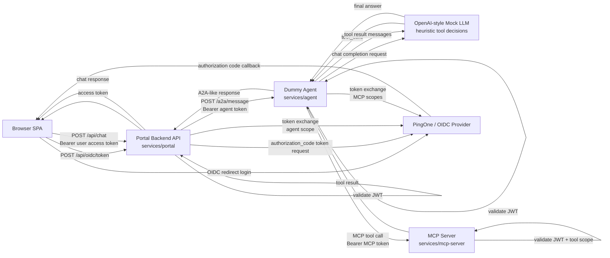
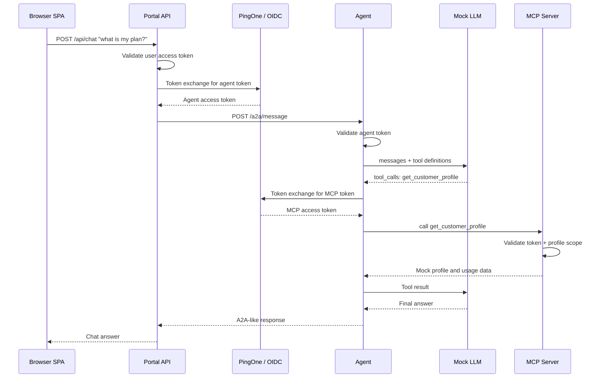
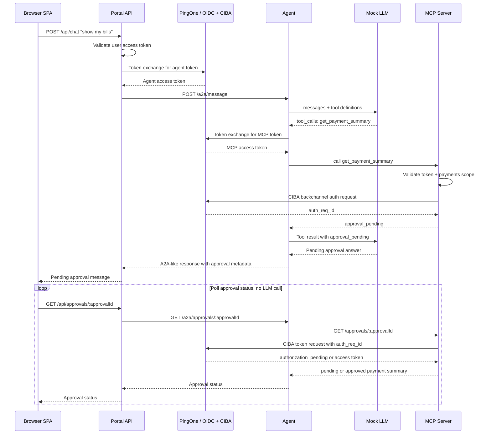

# Telco Customer AI Chatbot Demo

This is a mock telco customer-support chatbot project. Its goal is not to demonstrate a real LLM, but to demonstrate the identity and authorization patterns around an AI-style customer assistant:

- OIDC login for a browser-based customer portal.
- JWT validation at each service boundary.
- OAuth token exchange from the portal backend to the agent, and from the agent to MCP.
- MCP tool-level authorization with different scopes for profile and payment data.
- Human-in-the-loop payment access using CIBA.

The chatbot itself is deterministic. The agent exposes an A2A-like endpoint and internally uses an OpenAI-style mock chat-completion layer that returns tool calls, so the mock can later be replaced by a real LLM without changing the external agent contract.

## Components

- `services/portal`: plain HTML/JS SPA plus Node.js REST API. The SPA renders the public landing page, OIDC login, authenticated home page, and chatbot drawer. The backend validates frontend tokens, exposes `/api/me`, `/api/chat`, `/api/approvals/:approvalId`, and performs token exchange before calling the agent.
- `services/agent`: Node.js dummy customer-support agent. It validates inbound tokens, accepts an A2A-derived `message/send` JSON-RPC payload, invokes the mock OpenAI-style LLM layer, executes MCP tool calls, and returns the final agent response.
- `services/mcp-server`: Node.js MCP Streamable HTTP server using `@modelcontextprotocol/sdk`. It exposes mock customer profile and payment tools, validates inbound access tokens, enforces tool scopes, and starts/polls CIBA for payment data.
- `packages/shared`: shared auth, config, logging, HTTP, protocol, and scope helpers.

## Architecture



## Non-CIBA Flow

Profile and usage questions call the MCP profile tool only. No human approval is needed.



## CIBA Flow

Payment and bill questions call the MCP payment tool. The MCP tool is CIBA-protected, so the first response is `approval_pending`. Polling then checks the approval status without making another LLM call.



## Example Prompts

| Prompt | Tools | CIBA? | Behavior |
| --- | --- | --- | --- |
| `what is my current plan?` | `get_customer_profile` | No | Returns plan, account status, loyalty tier, cycle end, and usage. |
| `how much data have I used?` | `get_customer_profile` | No | Returns mobile and home data usage from the profile tool. |
| `show my bills` | `get_payment_summary` | Yes | Starts CIBA, returns pending approval, then polling returns recent bills after approval. |
| `what is my latest bill?` | `get_payment_summary` | Yes | Same CIBA-protected payment path. |
| `is there an outage?` | none today | No | The mock agent answers with general support guidance because no outage MCP tool exists yet. |

## MCP Tools And Scopes

| MCP tool | Purpose | Required inbound MCP scope |
| --- | --- | --- |
| `get_customer_profile` | Customer plan, services, devices, status, usage | `customer-support-agent:customer-mcp:profile:read` |
| `get_payment_summary` | Balance, due date, autopay, last payment, recent invoices | `customer-support-agent:customer-mcp:payments:read` |

The CIBA scope is separate from MCP authorization. MCP authorization is based on the inbound agent-to-MCP access token. `CIBA_SCOPE` only needs to match the PingOne CIBA app/policy requirements, often `openid`.

## PingOne Configuration

The demo is generic OIDC/OAuth, but the `.env.example` names the values you need from PingOne.

### 1. Portal SPA / Web App

Create an OIDC application for the customer portal login.

Required settings:

- Redirect URI: `http://localhost:3000/callback`
- Grant type: Authorization Code
- PKCE: enabled
- Client authentication:
  - Public + PKCE is acceptable for a pure SPA pattern.
  - Confidential web app is also supported because this demo exchanges the code through the portal backend. If confidential, set `OIDC_CLIENT_SECRET`.
- Scopes requested by the browser:
  - `openid`
  - `profile`
  - the portal API chat scope, for example `customer-support-agent:portal-api:chat`

Environment values:

```bash
OIDC_DISCOVERY_URI=https://auth.pingone.com/YOUR_ENVIRONMENT_ID/as/.well-known/openid-configuration
OIDC_CLIENT_ID=YOUR_PORTAL_CLIENT_ID
# OIDC_CLIENT_SECRET=YOUR_PORTAL_CLIENT_SECRET
OIDC_REDIRECT_URI=http://localhost:3000/callback
OIDC_SCOPES=openid profile customer-support-agent:portal-api:chat
API_EXPECTED_AUDIENCE=customer-support-agent-portal-api
```

### 2. Portal API Resource

Create or configure the API resource that represents the portal backend API.

Recommended scope:

```text
customer-support-agent:portal-api:chat
```

The current code validates the frontend token and expected audience at the portal API. If you want the portal API to enforce an inbound chat scope, add a required-scope check on `POST /api/chat`; the current primary authorization demonstration is downstream token exchange and MCP tool scopes.

### 3. Agent API Resource

Create an API resource for the agent service.

Recommended scope:

```text
customer-support-agent:agent:invoke
```

The portal backend uses OAuth token exchange to swap the inbound user token for an agent-scoped token before calling `/a2a/message`.

Environment values:

```bash
AGENT_EXPECTED_AUDIENCE=customer-support-agent-agent-api
AGENT_TOKEN_EXCHANGE_SCOPE=customer-support-agent:agent:invoke
API_OAUTH_CLIENT_ID=YOUR_PORTAL_BACKEND_CLIENT_ID
API_OAUTH_CLIENT_SECRET=YOUR_PORTAL_BACKEND_CLIENT_SECRET
```

The `API_OAUTH_CLIENT_ID` / `API_OAUTH_CLIENT_SECRET` client must be allowed to perform token exchange for the agent scope.

### 4. MCP API Resource

Create an API resource for MCP.

Required scopes:

```text
customer-support-agent:customer-mcp:profile:read
customer-support-agent:customer-mcp:payments:read
```

The agent backend uses OAuth token exchange to obtain an MCP-scoped token before calling MCP.

Environment values:

```bash
MCP_EXPECTED_AUDIENCE=customer-support-agent-customer-mcp
MCP_TOKEN_EXCHANGE_SCOPE=customer-support-agent:customer-mcp:profile:read customer-support-agent:customer-mcp:payments:read
AGENT_OAUTH_CLIENT_ID=YOUR_AGENT_BACKEND_CLIENT_ID
AGENT_OAUTH_CLIENT_SECRET=YOUR_AGENT_BACKEND_CLIENT_SECRET
```

The `AGENT_OAUTH_CLIENT_ID` / `AGENT_OAUTH_CLIENT_SECRET` client must be allowed to perform token exchange for both MCP scopes.

### 5. CIBA Configuration

Enable CIBA for payment approval. The payment MCP tool starts CIBA and returns `approval_pending` to the agent.

Required settings:

- CIBA/backchannel grant enabled for the CIBA client.
- A CIBA policy that accepts the configured `login_hint` value. This demo sends the authenticated subject as `login_hint`.
- Binding message length compatible with PingOne. This demo sends `PAYMENT`, which is within the 1-8 character range.
- OIDC discovery metadata must expose:
  - `backchannel_authentication_endpoint`
  - `token_endpoint`

Environment values:

```bash
CIBA_CLIENT_ID=YOUR_CIBA_CLIENT_ID
CIBA_CLIENT_SECRET=YOUR_CIBA_CLIENT_SECRET
CIBA_SCOPE=openid
CIBA_MOCK_APPROVAL_SECONDS=8
```

`CIBA_SCOPE` is sent to PingOne for the CIBA transaction. It is not used for MCP tool authorization. Keep it aligned with your PingOne CIBA policy.

## Setup

```bash
npm install
cp .env.example .env
```

Edit `.env` with your PingOne values.

## Run

Run all three services:

```bash
npm run dev
```

Open [http://localhost:3000](http://localhost:3000).

For a local bypass demo:

```bash
npm run dev:no-security
```

In `NO_SECURITY=true` mode:

- Login signs in a static user.
- JWT validation is bypassed by the portal, agent, and MCP.
- MCP receives static profile and payments scopes.
- CIBA uses mock approval timing instead of the real IdP approval path.

## Important Environment Variables

```bash
NO_SECURITY=false
AUTH_MODE=jwks
DEV_AUTH_ENABLED=false

PORTAL_PORT=3000
AGENT_PORT=3001
MCP_PORT=3002
AGENT_URL=http://localhost:3001
MCP_URL=http://localhost:3002/mcp
ALLOWED_ORIGINS=http://localhost:3000

API_EXPECTED_AUDIENCE=
AGENT_EXPECTED_AUDIENCE=
MCP_EXPECTED_AUDIENCE=

AGENT_TOKEN_EXCHANGE_SCOPE=
API_OAUTH_CLIENT_ID=
API_OAUTH_CLIENT_SECRET=

MCP_TOKEN_EXCHANGE_SCOPE=customer-support-agent:customer-mcp:profile:read customer-support-agent:customer-mcp:payments:read
AGENT_OAUTH_CLIENT_ID=
AGENT_OAUTH_CLIENT_SECRET=

OIDC_DISCOVERY_URI=
OIDC_CLIENT_ID=
OIDC_CLIENT_SECRET=
OIDC_REDIRECT_URI=http://localhost:3000/callback
OIDC_SCOPES=openid profile customer-support-agent:portal-api:chat

CIBA_CLIENT_ID=
CIBA_CLIENT_SECRET=
CIBA_SCOPE=openid
```

Do not commit `.env`; use `.env.example` for placeholders.

## Validation

```bash
npm test
npm run lint
```

## Notes For Replacing The Mock LLM

The external agent interface is `/a2a/message`. Internally, the agent calls `mockChatCompletion()` in `services/agent/src/mock-llm.js`, which returns an OpenAI-style response with `choices[0].message.tool_calls`.

To plug in a real LLM later:

1. Keep `/a2a/message` stable.
2. Replace `mockChatCompletion()` with a real chat-completions or responses client.
3. Keep MCP execution in the agent runtime, not in the model.
4. Continue validating tokens and exchanging tokens outside the LLM.
